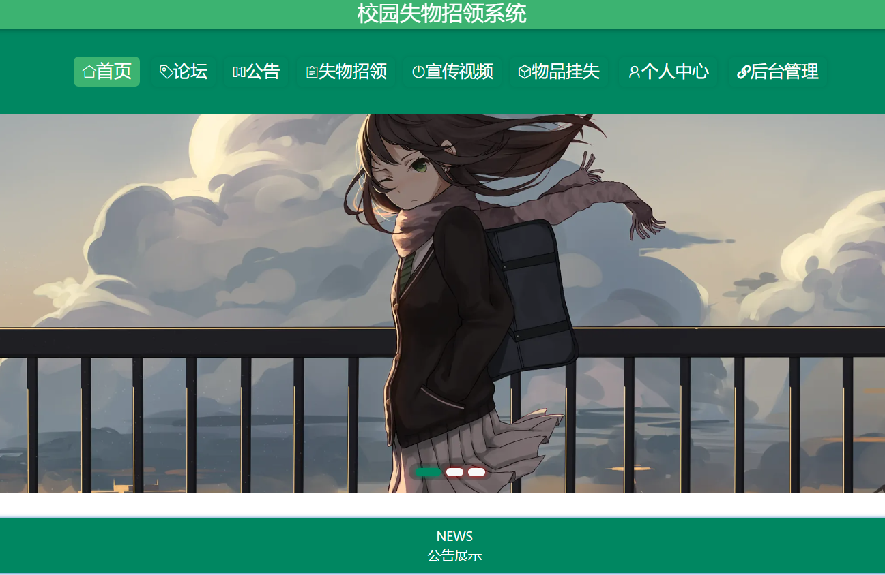
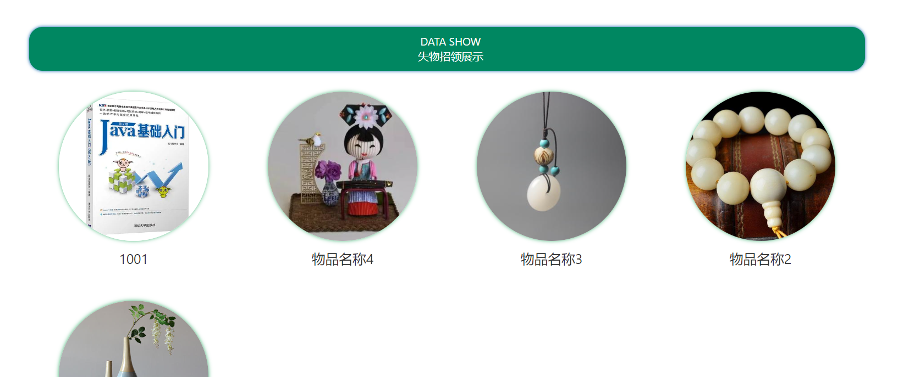
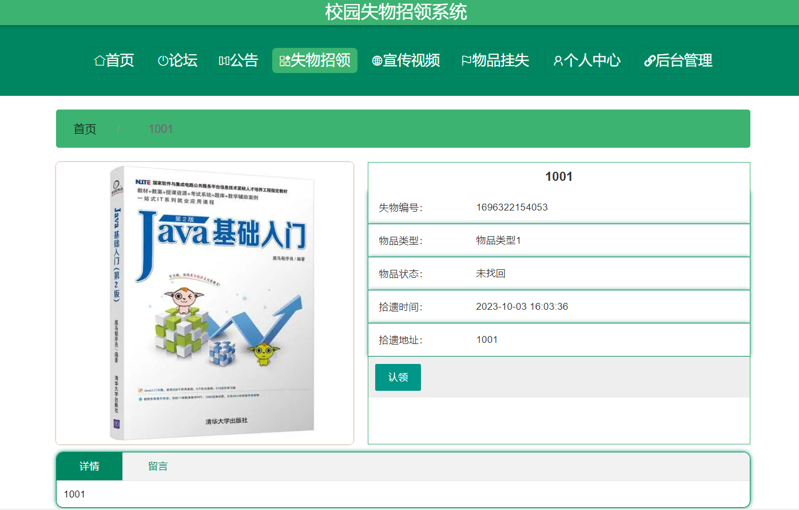
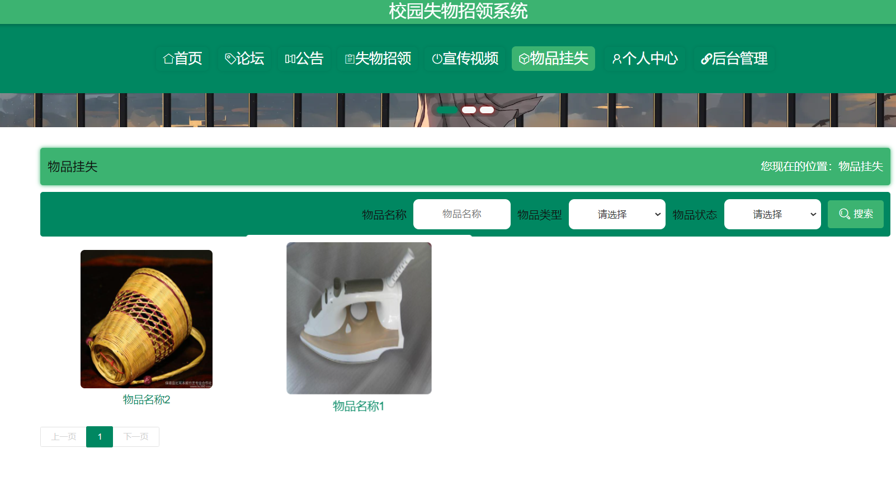
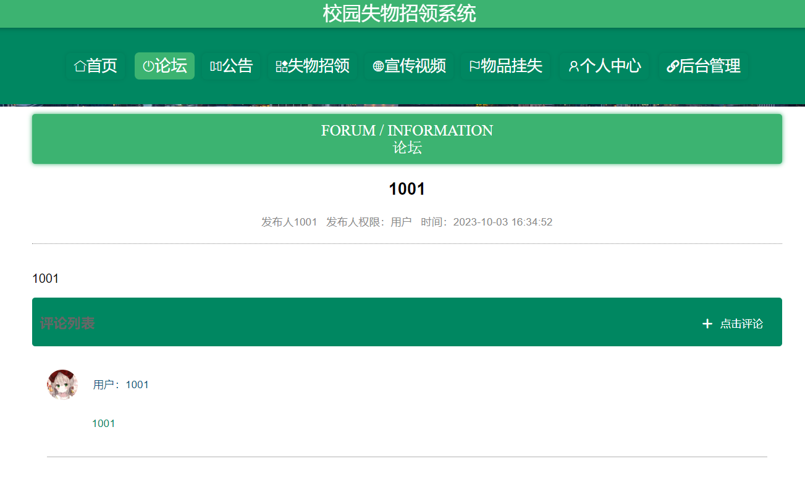
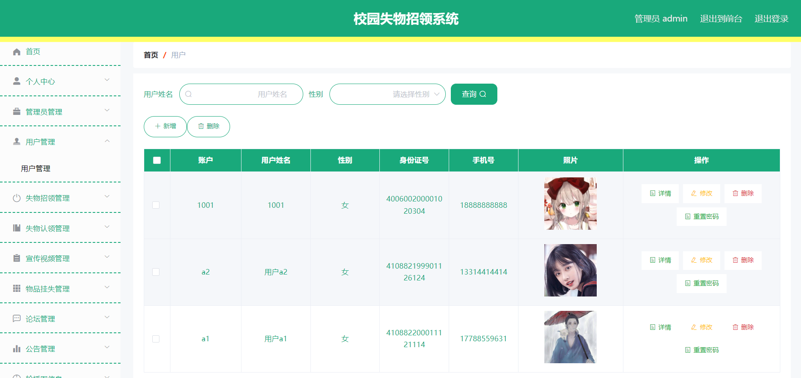
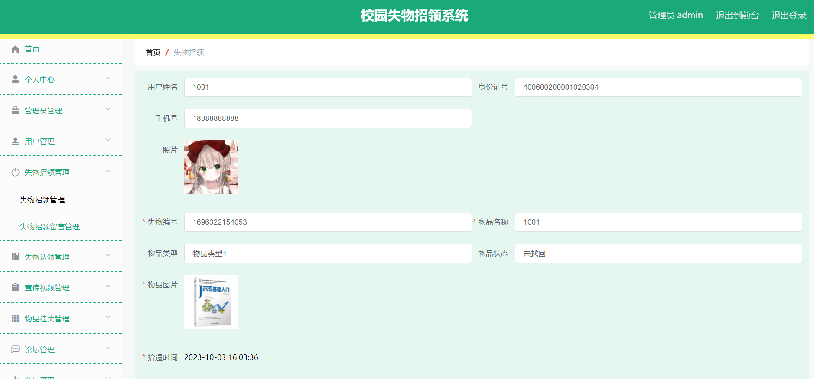

## 介绍

&emsp;&emsp;校园失物招领系统，失物招领管理系统，失物招领，物品挂失，毕业设计可以用来参考，具体功能如下图所示。

> 1. 后端技术：SpringBoot
> 2. 前端技术：Vue
> 3. 数据库：MySQL
> 4. 软件：IDEA/Ecilpse
> 5. Q：**3119403249**

## 系统展示

&emsp;&emsp;系统角色分为管理员、用户，管理员功能有首页、个人中心、管理员管理、用户管理、失物招领管理、失物认领管理、宣传视频管理、论坛管理、公告管理、轮播图信息、公告类型管理、物品类型管理等。用户功能有登录注册、公告、论坛、失物招领、宣传视频、物品挂失、个人中心。

#### 系统首页

> 可以看到轮播图、导航栏目等信息。

#### 失物招领

#### 物品详情

> 用户可以看到物品丢失的时间、地点，并且可以去认领。

#### 物品挂失

> 用户丢失物品以后可以在此挂失

#### 系统论坛

> 用户交流论坛，评论等。

#### 管理员界面

> 用户管理

> 失物招领管理

